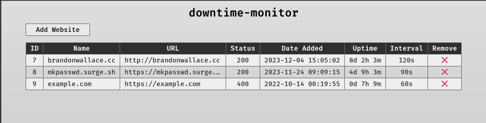

# Downtime-Monitor



### Clone

```
$ git clone git@github.com:brandon-wallace/downtime-monitor.git

$ cd downtime-monitor/
```

### Add a website URL and interval in seconds delimited by a comma in the websites.csv file.
```
$ vim websites.csv

https://new-example.com,60
```

### Format code

```
$ make fmt
```

### Examine code

```
$ make vet
```

### Build
```
$ make
```
### Or

```
$ make build
```

### Run

```
$ ./monitor
```
